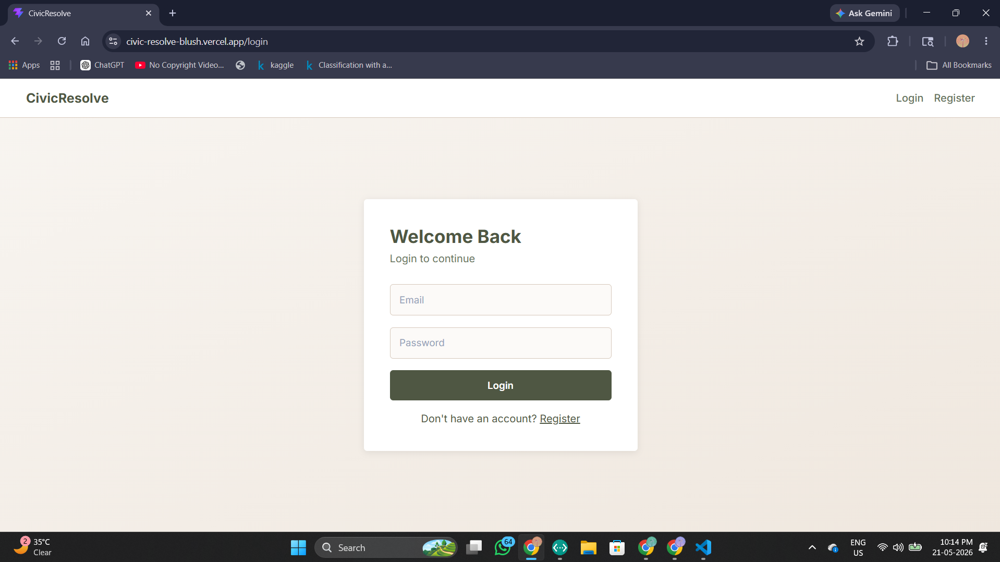
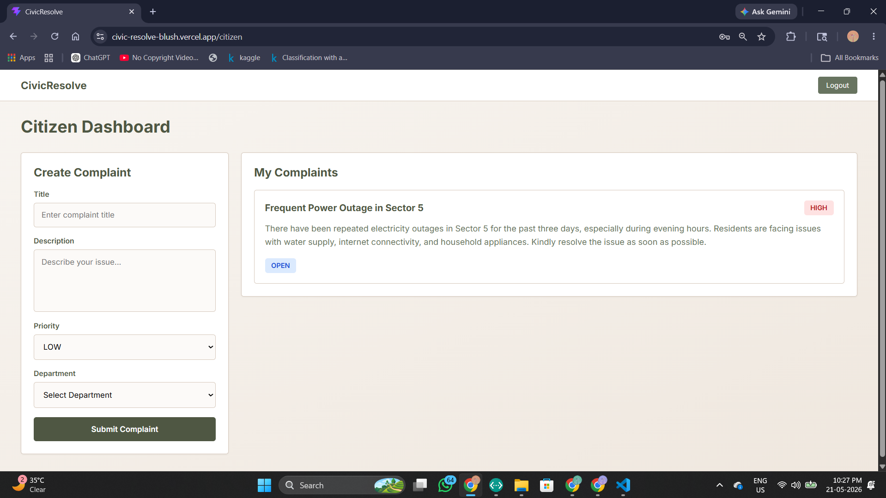
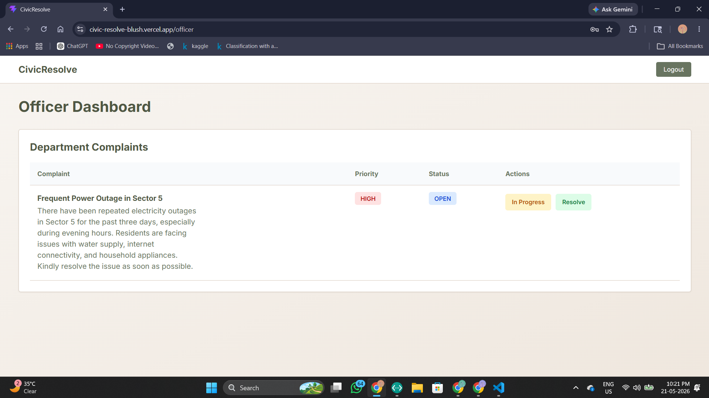
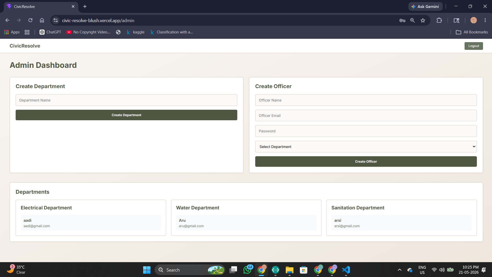

# 🚀 CivicResolve – Public Complaint Management System

A full-stack complaint management platform built with FastAPI, React, PostgreSQL, JWT Authentication, RBAC, and Docker.

The system allows citizens to register complaints related to civic issues, while department officers and admins manage and resolve them through role-based dashboards.

---

# Live Demo

Frontend: https://your-frontend-url.vercel.app

Backend API: https://your-backend-url.onrender.com

Swagger Docs: https://your-backend-url.onrender.com/docs

---

#  Features

##  Authentication & Security

- JWT Authentication
- HTTPOnly Cookie-based Authentication
- Password Hashing using bcrypt
- Role-Based Access Control (RBAC)
- Protected Frontend & Backend Routes

---

##  Roles

### Citizen

Can:

- Register/Login
- Create complaints
- View own complaints
- Track complaint status

Cannot:

- View others' complaints
- Update complaint statuses
- Access admin/officer routes

---

### Department Officer

Can:

- Login
- View department complaints
- Update complaint status
- Mark complaints resolved

Cannot:

- Register independently
- Access other departments
- Manage users

---

### Admin

Can:

- Create departments
- Create officers
- Assign officers to departments
- View all officers
- Manage system workflow

---

#  Tech Stack

## Backend

- FastAPI
- SQLAlchemy
- PostgreSQL
- Neon Database
- Alembic
- JWT Authentication
- Docker

---

## Frontend

- React.js
- Vite
- Axios
- React Router DOM

---

## Deployment

- Backend → Render
- Frontend → Vercel
- Database → Neon PostgreSQL
- Containerization → Docker + Docker Compose

---

#  Project Structure

```bash
CivicResolve/
│
├── backend/
│   ├── app/
│   │   ├── core/
│   │   ├── models/
│   │   ├── routes/
│   │   ├── schemas/
│   │   ├── dependencies/
│   │   ├── utils/
│   │   └── main.py
│   │
│   ├── alembic/
│   ├── Dockerfile
│   ├── requirements.txt
│   └── .env
│
├── frontend/
│   ├── src/
│   │   ├── pages/
│   │   ├── api/
│   │   ├── context/
│   │   ├── components/
│   │   └── App.jsx
│   │
│   ├── Dockerfile
│   └── package.json
│
└── docker-compose.yml
```

#  Database Schema

## Users Table

| Field | Type |
|---|---|
| id | UUID |
| name | String |
| email | String |
| password_hash | String |
| role | Enum |
| department_id | UUID (nullable) |

---

## Departments Table

| Field | Type |
|---|---|
| id | UUID |
| name | String |

---

## Complaints Table

| Field | Type |
|---|---|
| id | UUID |
| title | String |
| description | Text |
| priority | Enum |
| status | Enum |
| created_by | UUID |
| department_id | UUID |
| created_at | DateTime |

#  Docker Setup

## Run using Docker Compose

```bash
docker compose up --build
```

Frontend:

```bash
https://civic-resolve-blush.vercel.app
```

Backend:

```bash
https://civicresolve-p5ec.onrender.com
```

Swagger:

```bash
https://your-backend-url.onrender.com/docs
```

---

#  Backend Setup

## 1 Clone Repository

```bash
git clone https://github.com/adya07pandey/CivicResolve
```

---

## 2 Move to Backend

```bash
cd backend
```

---

## 3 Create Virtual Environment

```bash
python -m venv venv
```

Activate:

### Windows

```bash
venv\Scripts\activate
```

### Linux/Mac

```bash
source venv/bin/activate
```

---

## 4 Install Dependencies

```bash
pip install -r requirements.txt
```

---

## 5 Create `.env`

```env
DATABASE_URL=your_neon_database_url

SECRET_KEY=your_secret_key

ALGORITHM=HS256

ACCESS_TOKEN_EXPIRE_MINUTES=30
```

---

## 6 Run Alembic Migration

```bash
alembic upgrade head
```

---

## 7 Run Backend

```bash
uvicorn app.main:app --reload
```

---

#  Frontend Setup

## Move to frontend

```bash
cd frontend
```

---

## Install Dependencies

```bash
npm install
```

---

## Run Frontend

```bash
npm run dev
```

#  Security Practices Implemented

- JWT Authentication
- Password Hashing with bcrypt
- HTTPOnly Cookies
- Role-Based Access Control (RBAC)
- Protected Routes
- Input Validation using Pydantic
- Environment Variables for Secrets
- Secure Database Credentials
- Department-level Authorization

---

#  Scalability Notes

The project is designed with scalability and modularity in mind.

## Backend Scalability

- Modular FastAPI architecture
- Separate routes, schemas, models, and dependencies
- JWT-based stateless authentication
- Dockerized deployment
- Environment-based configuration
- Easily extensible modules
- Alembic database migrations

---

## Future Improvements

- Redis caching
- Rate limiting
- Async task queues (Celery)
- Notification system
- Image uploads
- Microservices architecture
- Kubernetes deployment
- CI/CD pipelines
- WebSocket notifications

---

#  Screenshots

## Login Page



---

## Citizen Dashboard



---

## Officer Dashboard



---

## Admin Dashboard



---

#  API Documentation

## Swagger UI

```bash
https://civicresolve-p5ec.onrender.com/docs
```

---

## ReDoc

```bash
https://civicresolve-p5ec.onrender.com/redoc
```


